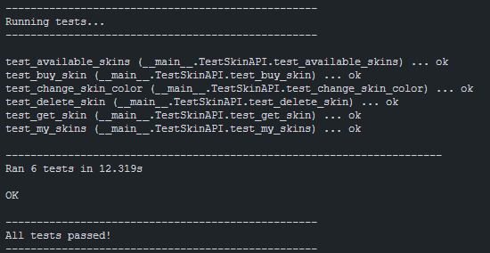

# Proyecto de Gestión de Skins de Videojuego

Este proyecto es una API que permite a los usuarios consultar, adquirir, modificar y eliminar skins para un videojuego. Utiliza Python como lenguaje de programación, Flask como framework web y MongoDB como base de datos.

## Requisitos

Asegúrate de tener las siguientes herramientas instaladas antes de comenzar:

- Python 3.x: https://www.python.org/
- MongoDB: https://www.mongodb.com/
- `make` (para gestionar el entorno virtual)

## Configuración

1. Clona este repositorio: **git clone [https://github.com/segama4/Jump2Digital_Backend.git](https://github.com/segama4/Jump2Digital_Backend.git)**
2. Accede al directorio del proyecto: **cd Jump2Digital_Backend**

3. Crea un entorno virtual (si aún no lo tienes) :

- En sistemas Unix (Linux y macOS): **make venv**
- En sistemas Windows (si no puedes ejecutar make): **python -m venv env**

4. Activa el entorno virtual:

- En sistemas Unix (Linux y macOS): **make activate_env**
- En sistemas Windows: ****source env/bin/activate****

5. Instala las librarías de Python necesarias:

- En sistemas Unix (Linux y macOS): **make install_dependencies**
- En sistemas Windows: ****pip install -r ./requirements.py****

## Uso

Una vez que hayas configurado el entorno y las dependencias, puedes iniciar la aplicación ejecutando `python app.py`. La API estará disponible en http://localhost:5000/api.

### Rutas de la API

- `GET /api/skins/available`: Retorna una lista de todas las skins disponibles para comprar.
- `POST /api/skins/buy`: Permite a los usuarios adquirir una skin y guardarla en la base de datos.
- `GET /api/skins/myskins`: Retorna una lista de las skins compradas por el usuario.
- `PUT /api/skins/color`: Permite a los usuarios cambiar el color de una skin comprada.
- `DELETE /api/skins/delete/{id}`: Permite a los usuarios eliminar una skin comprada.
- `GET /api/skins/getskin/{id}`: Retorna una skin específica basada en su identificación.

## Tests

Para asegurarte de que las pruebas pasen de manera efectiva, sigue estos pasos:

1. Asegúrate de que la aplicación esté en funcionamiento. Si aún no has iniciado la aplicación, sigue las instrucciones mencionadas en la sección **Uso**.
2. Una vez que la aplicación esté en funcionamiento, puedes ejecutar las pruebas unitarias de forma paralela. Abre una nueva terminal y ejecuta el siguiente comando: **python .\tests.py**

## Licencia

Este proyecto está bajo la Licencia MIT. Consulta el archivo [LICENSE](LICENSE) para obtener más detalles.

## Contacto

Si tienes alguna pregunta o comentario, no dudes en ponerte en contacto con Sergi Garriga Mas a través de garriga2002@gmail.com.
